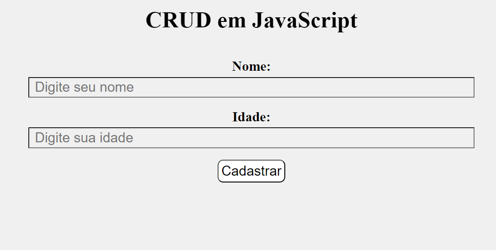
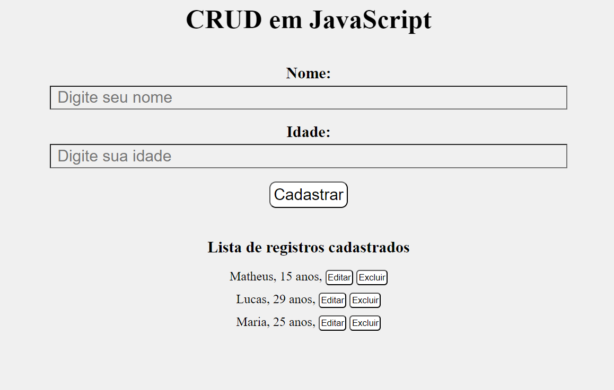

# Creating a CRUD in JavaScript (JS)

## A fully functional EXAMPLE project written in JavaScript showing how to manipulate data using the 4 pillar of a complete CRUD

This project is an example that was built by myself demonstrating how to manipulate (create, read, update and delete) data in javaScript

       

## How to tweak this project for your own uses
I´d encourage you to visit my personal blog where I explain step by step how to build your own CRUD in JavaScript.
-[how to build a CRUD in JS] (https://lucas-gualberto94.github.io/angular-blog/1)

Feel free to explore other blogs written by me about technology or science and education
-[my personal blog] (https://lucas-gualberto94.github.io/angular-blog/)

## 📖 Useful links

-[Working CRUD in JS] (https://lucas-gualberto94.github.io/CRUD-JS/)